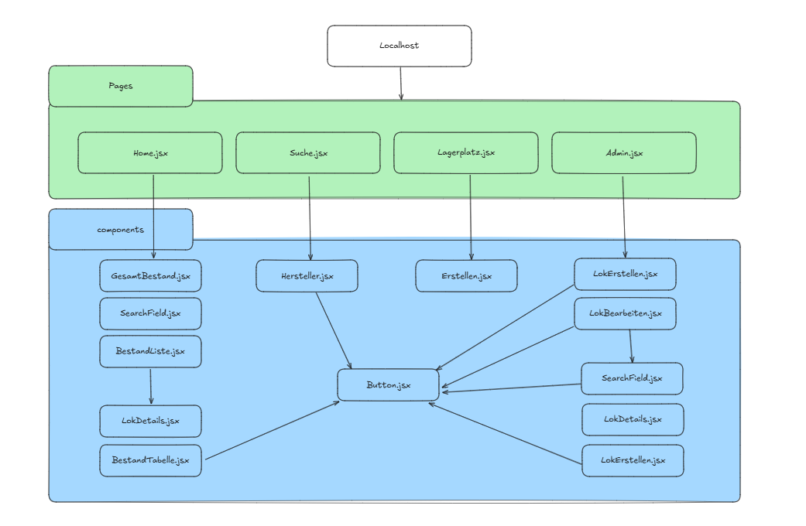
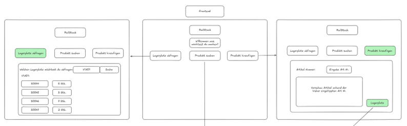
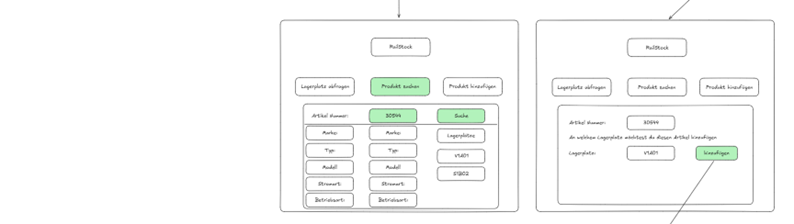
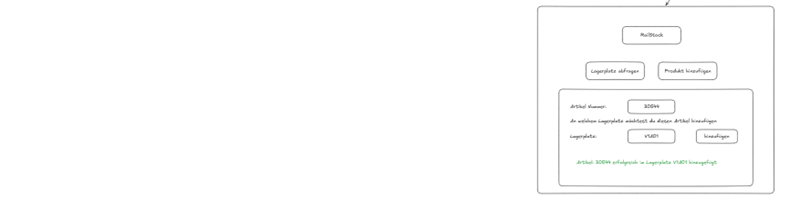

# RailStock – Lagerbewirtschaftungssoftware (Frontend)

Dieses Repository enthält das **Frontend der RailStock-Lagerbewirtschaftungssoftware**.  
Es stellt die Benutzeroberfläche bereit, über die Anwender Lokomotiven, Lagerplätze und Bestände verwalten können.  
Das Frontend kommuniziert über die REST-API mit dem [RailStock Backend](https://github.com/ImeschNico/RailStock-Lagerbewirtschaftungssoftware-Backend).

---

## Technologien

- **React 19.1.1**
- – Moderne UI-Bibliothek für komponentenbasiertes Entwickeln
- **Vite 7.1.7**
- – Schnelles Build-Tool und Dev-Server
- **React Router 7.9.2**
- – Navigation zwischen Views
- **@vitejs/plugin-react 5.0.3**
- – React-Support für Vite

---

## Installation & Setup

### Voraussetzungen

- Node.js 20+
- npm oder yarn

### Schritte

1. Repository klonen:

   ```bash
   git clone https://github.com/ImeschNico/RailStock-Lagerbewirtschaftungssoftware-Frontend.git

   ```

2. In das Projektverzeichnis wechseln:

   ```bash
   cd RailStock-Lagerbewirtschaftungssoftware-Frontend

   ```

3. Abhängigkeiten installieren:

   ```bash
   npm install

   ```

4. Entwicklungsserver starten:

   ```bash
   npm run dev

   ```

5. Das Frontend ist dann unter:
   http://localhost:5173 verfügbar.

---

## Features

- Dashboard – Übersicht über Lokomotiven, Lagerplätze und Bestände
- Lokomotivenverwaltung – Anzeigen, Anlegen, Bearbeiten, Löschen
- Lagerplatzverwaltung – Anzeigen, Anlegen, Bearbeiten, Löschen

- Bestandsverwaltung – Anzeigen, Transfer zwischen Lagerplätzen, Anlegen, Bearbeiten

---

## Pages & Components



## Mock-Ups





**Hinweis:** Diese Mock-Ups wurden als Inspiration erstellt und dienen als konzeptionelle Vorlagen.  
Der aktuelle Entwicklungsstand kann daher von diesen Darstellungen abweichen.
