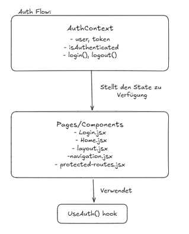
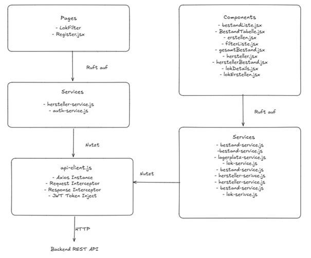
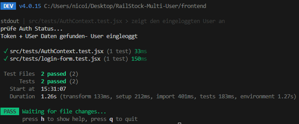

# Frontend Architektur

## Component-Architektur

Component-Architektur findet man hier:
[Component-Archiktetur](./frontend-structure.txt)

---

## State-Management Flow



---

### Erklärung

### State-Management und Authentifizierungs-Flow im Projekt

**Globaler State – AuthContext:**

Das Projekt verwendet einen zentralen Context (AuthContext) für das
State-Management der Authentifizierung.
Dieser Context hält die folgenden Informationen:

- user: enthält die Benutzerdaten (id, username, email, role)
- token: Authentifizierungs-Token
- isAuthenticated: Boolean, ob der Benutzer eingeloggt ist
- login() und logout(): Methoden, um den Login-Status zu ändern

---

### Provider:

Der **AuthContext.Provider** umschließt die gesamte App bzw. die
Layout-Komponente, sodass alle Seiten und Komponenten Zugriff auf den Auth-State
haben.

---

### Konsumieren des States:

Komponenten greifen über den Hook useAuth() auf den Auth-State zu. Dadurch können
sie prüfen, ob ein Benutzer eingeloggt ist oder welche Rolle er hat, und
entsprechend Inhalte rendern oder Zugriffe verweigern.

---

### Geschützte Routen:

Seiten wie Home, Admin oder andere sensible Bereiche sind mit der
ProtectedRoute-Komponente gesichert.

- Ist der Benutzer nicht eingeloggt, wird er automatisch auf die Login-Seite
  umgeleitet.

- Wenn für eine Route eine bestimmte Rolle erforderlich ist (z. B. ADMIN), prüft
  ProtectedRoute die Rolle des Benutzers und leitet ggf. auf eine „Forbidden“-Seite
  weiter.

---

### Öffentliche Seiten:

Login- und Register-Seiten sind öffentlich zugänglich. Ist der Benutzer bereits
eingeloggt, wird er automatisch weitergeleitet, z. B. auf /home.

---

### Zusammengefasst:

- AuthContext stellt globalen Auth-State zur Verfügung
- Provider sorgt dafür, dass alle Komponenten diesen State nutzen können
- useAuth() hook ermöglicht einfachen Zugriff auf den State
- ProtectedRoute schützt sensible Seiten basierend auf Login-Status und Rolle

---

## API-Integration (Service-Layer)



---

### 1. Pages

Die Pages (LokFilter.jsx, Register.jsx) repräsentieren die Benutzeroberfläche auf
hoher Ebene.

- Sie lösen Aktionen aus, z. B. Datenabfrage oder Formularabsendung.
- Pages rufen Funktionen aus den Services auf.

---

### 2. Components

Einzelne UI-Komponenten (BestandListe.jsx, BestandTabelle.jsx, Erstellen.jsx,
LokDetails.jsx, LokErstellen.jsx, usw.) kapseln wiederverwendbare Teile der
Benutzeroberfläche.

- Komponenten interagieren ebenfalls mit Services, um Daten zu laden, zu erstellen
  oder zu aktualisieren.

---

### 3. Services

Services (bestand-service.js, lok-service.js, lagerplatz-service.js,
hersteller-service.js, auth-service.js) kapseln die Logik zur Kommunikation mit
der API.

- Sie abstrahieren HTTP-Requests und liefern aufbereitete Daten zurück.
- Services nutzen die zentrale api-client.js für die HTTP-Kommunikation.

---

### 4. API Client (api-client.js)

- Stellt eine Axios-Instanz bereit
- Beinhaltet Request/Response Interceptors
- Führt JWT-Token-Injection durch
- Alle Services greifen auf diese Instanz zu, um Requests an das Backend zu senden.

---

### 5. Backend REST API

- Empfängt HTTP-Anfragen von api-client.js
- Liefert JSON-Antworten, die dann von den Services zurück an die Komponenten oder
  Pages weitergeleitet werden.

---

### 6. Flow Zusammenfassung:

- Pages und Components → rufen Services auf → Services → nutzen api-client.js →
  senden HTTP-Requests → Backend REST API → Daten werden zurück über Services →
  Pages/Components geliefert.

---

## Tech-Steck Frontend

| Technologie               | Version | Verwendung                              |
| ------------------------- | ------- | --------------------------------------- |
| React                     | 19.1.1  | UI-Framework                            |
| React DOM                 | 19.1.1  | UI-Rendering                            |
| React Router DOM          | 7.9.2   | Client-Side Routing                     |
| Axios                     | 1.13.2  | HTTP-Client für API-Calls               |
| Context API               | 19.1.1  | Globales State-Management (z. B. Auth)  |
| Vite                      | 7.1.7   | Build-Tool & Dev-Server                 |
| ESLint                    | 9.36.0  | Linting & Code Style                    |
| @vitejs/plugin-react      | 5.0.3   | React-Plugin für Vite (Hot Reload etc.) |
| eslint-plugin-react-hooks | 5.2.0   | Hooks-Linting                           |

---

### Beschreibung

Das Frontend nutzt React (Version 19) zusammen mit Vite (Version 7) als Build-Tool
und Dev-Server. React Router DOM übernimmt die Navigation zwischen den Pages. Der
AuthContext speichert den eingeloggten Benutzer global, sodass alle Komponenten
darauf zugreifen können. Axios wird für API-Calls genutzt und injiziert
automatisch den JWT-Token in jeden Request via Interceptor. Protected Routes
prüfen, ob ein Benutzer eingeloggt ist, und leiten sonst zur Login-Page weiter.
ESLint sorgt für konsistenten Code und überprüft Hooks mit entsprechenden Plugins.

---

## Tests

| Test Nr. | Test-Datei                       | Testname                                     | Schritte /Beschreibung                                                                                                                                                                           | Erwartetes Ergebnis                     | Ergebnis  |
| -------- | -------------------------------- | -------------------------------------------- | ------------------------------------------------------------------------------------------------------------------------------------------------------------------------------------------------ | --------------------------------------- | --------- |
| 1        | `src/tests/login-form.test.jsx`  | zeigt Username, Passwort und Login-Button an | 1. `LoginForm` rendern<br>2. Prüfen, ob die Labels `Benutzername` / `Passwort` und der Button `Einloggen` im DOM sind                                                                            | Alle Formularfelder und Button sichtbar | Bestanden |
| 2        | `src/tests/AuthContext.test.jsx` | zeigt den eingeloggten User an               | 1. `TestComponent` rendern, die `useAuth()` nutzt<br>2. `AuthProvider` rendern<br>3. `localStorage` mit Token und User-Daten mocken<br>4. Prüfen, ob Text `Logged in as testuser` angezeigt wird | Text `Logged in as testuser` im DOM     | Bestanden |

## Test Resultate



---

## Set-up Guide/ Installation

### 1. Voraussetzungen

Bevor du das Projekt startest, stelle sicher, dass folgende Tools installiert sind:

Node.js (empfohlen LTS Version, z. B. 20.x)
Prüfen:

```bash
node -v
```

npm (kommt mit Node.js)
Prüfen:

```bash
npm -v
```

### 2. Projekt klonen

Klonen des Frontend-Repositories von Git:

```bash
git clone https://github.com/ImeschNico/RailStock-Multi-User.git
cd frontend
```

### 3. Abhängigkeiten installieren

Installiere alle benötigten Pakete:

```bash
npm install
```

### 4. Entwicklungsserver starten

Starte das Frontend:

```bash
npm run dev
```

Frontend startet auf:

```bash
http://localhost:5173
```

### 6. Testen

Das Projekt verwendet Vitest und React Testing Library:

```bash
npm run test
```

---
